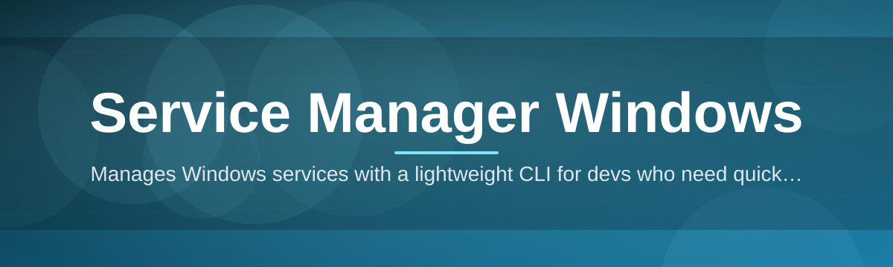

# service-windows-controller 🧰⚡

  

*One dev, one binary, zero patience for services.msc — control every Windows service from a single clean window.*

  

## 🔍 Overview

`service-windows-controller` is a lightweight command center for the thing Windows never bothered to make pleasant: managing services. If you've ever waited for `services.msc` to load its entire alphabetized graveyard of drivers and background daemons just to restart one print spooler, this project exists so you never have to do that again. It's a Service Manager for Windows built by a solo developer who got tired of the built-in tooling and decided to ship something that actually respects your time.

At its core, this is a fast, focused desktop utility for viewing, starting, stopping, restarting, and configuring Windows services — with search, filtering, batch actions, and startup-type editing baked in from day one. It's aimed at sysadmins juggling dozens of machines, developers who spin local services up and down constantly, and power users who just want a Windows service manager that doesn't feel like it was designed in 2003 (even though, structurally, some of it still is).

There's no bloat here. No telemetry dashboards, no forced sign-in, no subscription nag screens. Just a native Windows tool that talks directly to the Service Control Manager and gets out of your way. It's the kind of project that grows because people actually use it daily, not because it was marketed hard once and forgotten.

---

## 🚀 What It Actually Does

> [!TIP]
> Every capability below was built because a real workflow needed it — not because a feature checklist demanded it.

- **Instant service search** — type three letters and the entire service list filters live, no more scrolling through hundreds of alphabetized entries to find "WSearch."

- **Batch state changes** — select a dozen services and start, stop, or restart them together, instead of clicking through the same dialog twelve times.

- **Startup type editor** — flip a service between Automatic, Manual, and Disabled inline, without opening a separate properties window every time.

- **Dependency mapping** — see what a service relies on and what relies on it, so you stop guessing why stopping one thing silently kills three others.

- **Live status polling** — the list refreshes service states in near real-time, so "Running" actually means running right now, not five minutes ago.

- **One-click diagnostics** — grab recent event log entries tied to a specific service without leaving the app or opening Event Viewer.

- **Portable, standalone execution** — the whole controller runs from a single executable with no installer wizard and no registry sprawl left behind.

- **Dark and light themes** — because service management at 2 AM deserves a UI that doesn't blind you.

  

---

## 🏁 Up and Running

Getting this Service Manager for Windows running takes minutes, not a deployment plan.

1. **Visit the landing page** using the button above or below — that's the only official source for downloads.

2. **Download the executable** for your Windows version (10 or 11, both supported natively).

3. **Run it directly** — no installer, no setup wizard, no reboot required.

4. **Grant elevated permissions when prompted** — service control operations require administrator rights on Windows by design, this isn't optional.

> [!IMPORTANT]
> Windows will show a SmartScreen prompt for new or less-common executables. This is standard for unsigned or newly-signed indie tools — click "More info" then "Run anyway" if you trust the source (and you downloaded it from the official landing page, so you should).

---

## 💻 System Requirements

| Component | Requirement |
|---|---|
| OS | Windows 10 (1809+) or Windows 11 |
| Architecture | x64 |
| Disk space | Under 50 MB |
| Dependencies | None — fully standalone |
| Admin rights | Required for most service actions |
| .NET runtime | Bundled, no separate install needed |

> [!NOTE]
> No dependencies means no dependency hell. There's nothing to update separately, nothing to break your PATH, and nothing hiding in `%appdata%` you didn't ask for.

---

## ⚙️ How It Works

The architecture is intentionally simple — a thin, fast layer sitting directly on top of the Windows Service Control Manager (SCM), the same system component `services.msc` and `sc.exe` talk to under the hood.

1. On launch, the app queries the SCM for the full service registry.

2. Each service's state, startup type, and dependency chain gets cached in memory for instant filtering.

3. User actions (start/stop/restart/edit) get translated into direct SCM API calls.

4. The SCM executes the change at the OS level and reports back a result code.

5. The UI reflects the new state immediately, with a background poller keeping everything honest over time.

---

## 🩹 Troubleshooting

<strong>A service shows "Running" but won't respond to a stop command</strong>

Some services are configured to ignore stop requests or depend on a parent process holding a handle open. Check the dependency tree in-app first — stopping a dependent service before the parent often unblocks it.

<strong>Access denied when trying to change startup type</strong>

This almost always means the app isn't running elevated. Right-click the executable and choose "Run as administrator," or accept the elevation prompt when it appears at launch.

<strong>SmartScreen flagged the download as unrecognized</strong>

Expected behavior for smaller, independently-published Windows tools without a long-standing signing reputation yet. Download only from the official landing page linked in this README to stay safe.

<strong>A service I stopped restarted itself a few seconds later</strong>

Some Windows services are configured with automatic recovery or are triggered by another service/event. Check the "Recovery" tab inside the tool to see the configured failure-response behavior.

<strong>The app doesn't show a driver-level service I expected to see</strong>

Kernel driver services are filtered out of the default view to keep the list readable. Toggle "Show driver services" in Settings if you specifically need to manage those.

> [!WARNING]
> Disabling core Windows services you don't recognize (especially ones prefixed with "rpc," "dcom," or "wmi") can destabilize the OS. When unsure, search the exact service name before touching its startup type.

---

## 🎛️ UI & UX Details

The interface is built for keyboard-first sysadmins who resent reaching for the mouse every ten seconds.

| Shortcut | Action |
|---|---|
| `Ctrl + F` | Focus search bar |
| `Ctrl + R` | Restart selected service(s) |
| `Ctrl + S` | Stop selected service(s) |
| `Ctrl + Shift + S` | Start selected service(s) |
| `F5` | Force refresh service list |
| `Ctrl + ,` | Open Settings |

Additional touches:

- Light and dark themes, switchable instantly without restarting the app.

- Column customization — show or hide startup type, PID, or description columns.

- Persistent window state — it remembers size, position, and last filter between sessions.

- Notification toast on failed operations, with the raw SCM error code included for quick lookup.

> [!TIP]
> Pin frequently-managed services to the top of the list — useful if you're constantly babysitting the same three background processes.

---

## 🤝 Contributing & Community

This project is community-first, full stop. It started as a solo build, but it grows because people file real bugs, request real features, and occasionally send a pull request that fixes something the maintainer didn't even know was broken.

- **Found a bug?** Open an issue with your Windows build number and repro steps — vague reports get vague answers.

- **Have an idea?** Start a discussion before opening a PR for anything non-trivial, so the direction gets agreed on first.

- **Want to contribute code?** Fork it, branch it, keep changes focused, and open a pull request with a clear description of what and why.

- **Roadmap items currently being explored:** remote service management over a local network, service grouping/tagging, and a lightweight CLI companion mode.

> [!NOTE]
> Discussions tab is the best place for "how do I..." questions. Issues are reserved for actual bugs and concrete feature requests — keeps the tracker usable for everyone.

---

## 📄 License

Released under the [MIT License](LICENSE), 2026. Use it, fork it, ship your own variant — just keep the license notice intact.

---

## ⚠️ Disclaimer

This tool interacts directly with core Windows service infrastructure. Misconfiguring or disabling essential system services can cause instability, boot issues, or data loss. The maintainer and contributors are not responsible for damage resulting from misuse. Always know what a service does before changing its state, and consider a system restore point before mass-editing startup types.

